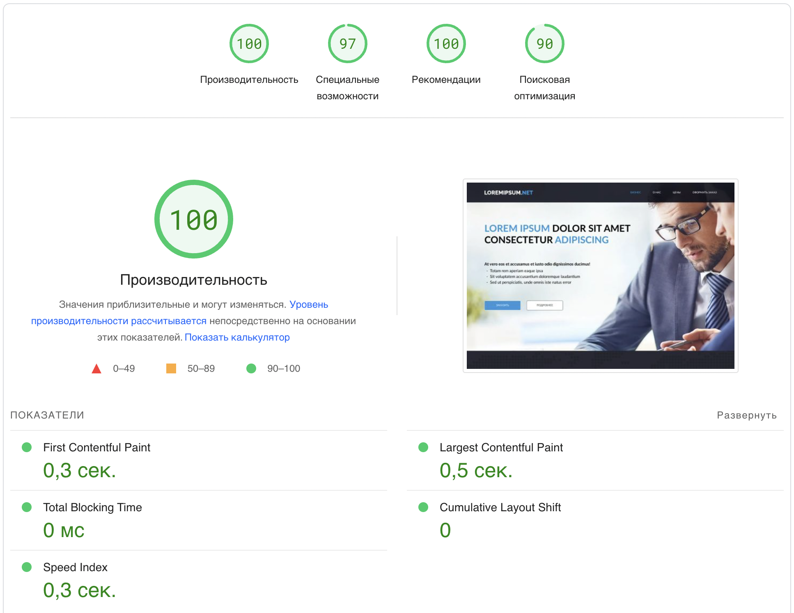
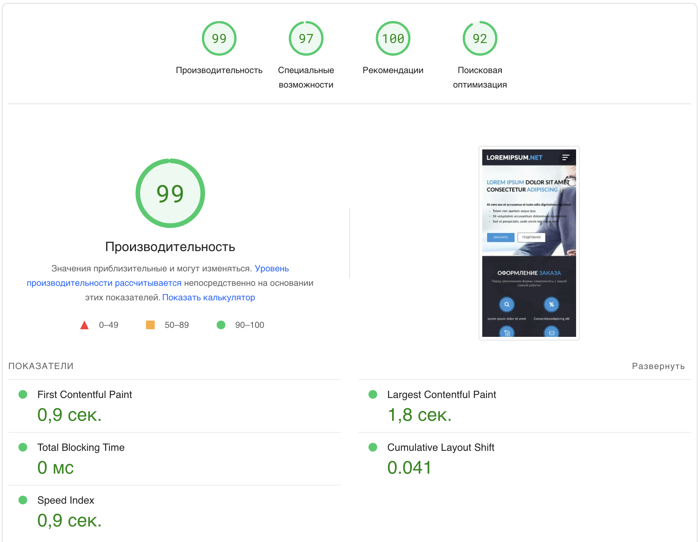

# Softcorp
Test task for Softcorp

#### Github pages link
https://tekkaee.github.io/softcorp/

## Notes
new components html put in ```src/ui/blocks```
new content html put in ```src/ui/pages```

new components styles put in ```src/scss/blocks```
new content styles put in ```src/scss/pages```

new js files put in ```src/js```

for import new html use ```@@include('./ui/{type}/{name}.html')```

## Installation
```sh
{root_project}
npm install
```
## Developer build
```sh
{root_project}
npm run dev
```

## Production build
```sh
{root_project}
npm run prod
```

## Google page speed
### Desktop test

### Mobile test
